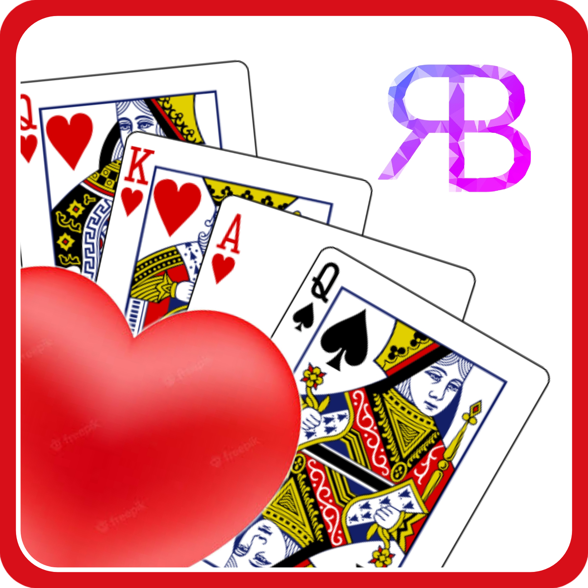

# Hearts Game

[](https://github.com/tterb/atomic-design-ui/blob/master/LICENSEs) [](https://app.netlify.com/sites/nielbrioneshearts/deploys)

"Hearts" is a card game in which the goal is to pass all of your cards to your opponents, each "Hearts" card is equivalent to 1 point while the "Queen of Spades" is equal to 13 points. The player with the lowest points wins.

### Acknowledgements

- The [Deck of Cards API](https://deckofcardsapi.com) by Chase Roberts.
- Playing card back design from [Ornament Vectors by Vecteezy](https://www.vecteezy.com/free-vector/ornament).
- [Loading Heart](https://icons8.com/icon/RdwpURQDRqej/loading-heart) icon by [Icons8](https://icons8.com)

<br />

This project is deployed on Netlify

[Browse Hearts Game](https://nielbrioneshearts.netlify.app)

<br />

## Run Locally

Clone the project

```bash
  git clone https://github.com/scinth/react-hearts-game myproject
```

Go to the project directory

```bash
  cd myproject
```

Install dependencies

```bash
  npm install
```

Start the server

```bash
  npm run start
```

<br />

## Tech Stack

 &nbsp;


<br /><hr /><br />

For comments and suggestions, please reach out to me at<br/>
[ rodnielbriones@gmail.com](rodnielbriones@gmail.com)
